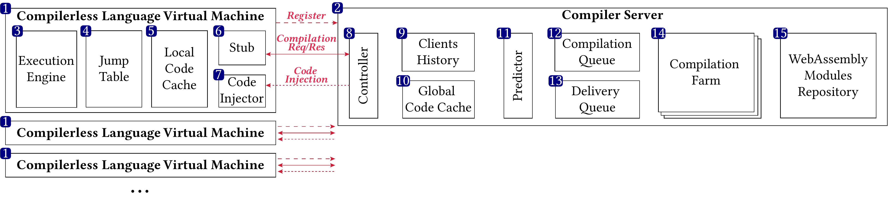
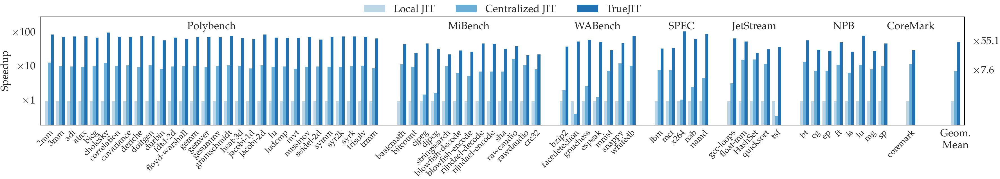
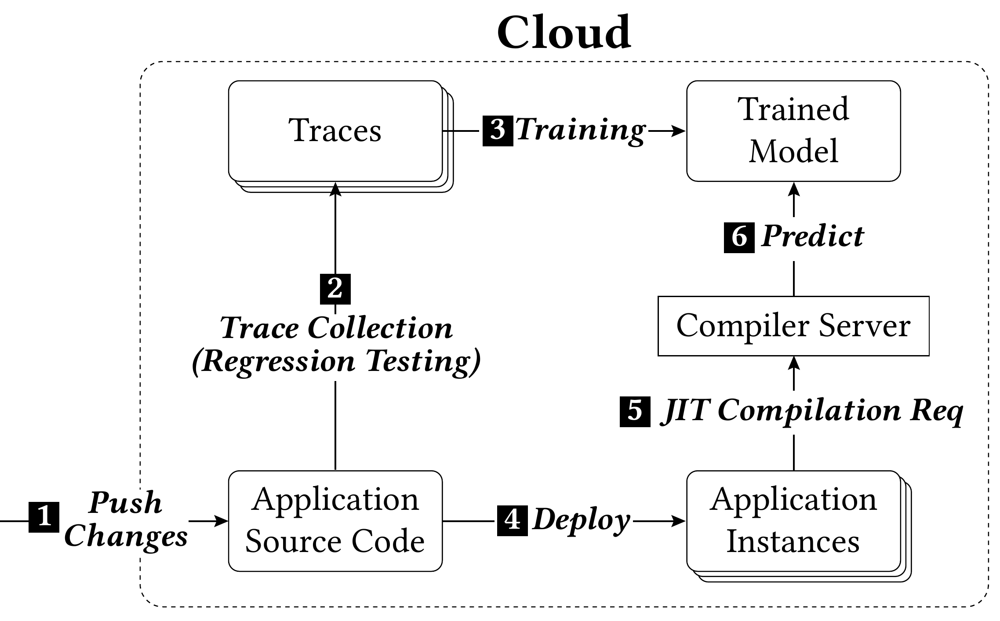

# TrueJIT

TrueJIT is the implementation of **"TrueJIT: Learning and Prediction of Compilation Sequences in a Centralized JIT Compiler"**, a predictive centralized JIT compiler for WebAssembly. It learns application-specific compilation traces, speculatively compiles likely future functions, and proactively delivers native code to lightweight clients before they stall on remote compilation.

This repository contains the runtime implementation, benchmark workloads, pre-trained LSTM models, evaluation scripts, deployment artifacts, and supporting assets used to study low-latency remote JIT compilation at scale.

<p align="center">
  
</p>

TrueJIT splits compilation away from the client runtime. Multiple compiler-less language virtual machines (LVMs) send requests to a centralized compilation server, which combines:

- a global native code cache
- an LLVM-based compilation service
- an LSTM-based predictor over compilation request sequences
- proactive code delivery back to client-local code caches

TrueJIT is built around two core ideas:

1. JIT compilation sequences can be learned and predicted.
2. Those predictions can be used to hide centralized JIT latency rather than just amortize it.

## Why this project exists

Centralized JIT compilation already reduces duplicate compilation work by sharing compiled code across many clients, but it also adds network latency. TrueJIT addresses that tradeoff with two linked ideas:

- **Predictive compilation** warms the server-side global cache before a client asks for a function.
- **Predictive code delivery** pushes compiled code into the client-side cache before the function is reached.

The result is "true" just-in-time behavior from the client's perspective: native code is ready when it is needed, even though compilation is remote, combining centralized compilation efficiency with startup behavior that feels much closer to local execution.

## Highlights

<p align="center">
  
</p>

Representative results include:

- Standard centralized JIT compilation with global caching already reduces JIT latency by **7.6x** on average over a local-JIT baseline.
- TrueJIT increases that to **55.1x average speedup** over local JIT by combining predictive compilation and predictive delivery.
- On the SPEC `gcc` benchmark, the paper reports **over 95% accuracy for the next compilation request**, about **80% at depth 10**, and about **50% at depth 100**.
- The predictor remains useful across application revisions: a model trained on one LLVM version still achieves **more than 80% accuracy** on the next major version in the paper's cross-version experiment.
- The memory overhead of the predictor is small relative to the rest of the distributed runtime, and the centralized schemes become more memory-efficient than local JIT once the deployment scales beyond very small client counts.

TrueJIT has been evaluated on SPEC CPU2017, PolyBench/C, NPB, MiBench, JetStream 2, WABench, CoreMark, FFmpeg, and SQLite3 workloads, with large-scale CloudLab experiments reaching up to 10,000 client processes.

## Repository layout

| Path | Purpose |
| --- | --- |
| [`lib/`](lib) | Core runtime, compiler, predictor, networking, orchestration, and VM implementation |
| [`tools/`](tools) | CLI entry points such as `remote-compiler`, `vm-without-compiler`, `vm-with-compiler`, `worker`, `orchestrator`, and `static-compiler` |
| [`benchmarks/`](benchmarks) | WebAssembly workloads, benchmark metadata, and Python benchmark harnesses |
| [`models/`](models) | Pre-trained TorchScript LSTM models used by predictive mode |
| [`evaluation/`](evaluation) | Notebooks, plotting scripts, and experiment automation used to generate evaluation data and figures |
| [`kubernetes/`](kubernetes) | CloudLab/Kubernetes deployment artifacts for distributed experiments |
| [`scripts/`](scripts) | Small helper scripts, including the worker loop used in containers |
| [`binaries/`](binaries) | Output area for generated native objects and related artifacts |
| [`plans/`](plans) | Static/planned compilation and specialization plans used by some experiments |

## Core executables

After a successful build, the main binaries are:

| Binary | Role |
| --- | --- |
| `remote-compiler` | Standalone centralized JIT server listening on port `50051` |
| `vm-without-compiler` | Compiler-less client VM that talks to a remote compiler on `localhost:50051` |
| `vm-with-compiler` | Single-process mode that embeds both VM and compiler for local experimentation |
| `worker` | Remote worker process that executes commands from an orchestrator |
| `orchestrator` | Control-plane process for multi-worker experiments on port `50052` |
| `static-compiler` | Compiles all functions of a module to signed native objects |

Important runtime options exposed through the CLI include:

- `--sync=jit|aot|predictive.lstm-N`
- `--async=all|planned|dynamic|static`
- `--compiler=llvm|clift`
- `--optimization=0..3`
- `--vm-cache`, `--client-cache`, `--server-cache`
- `--dir=<preopened-dir>` for WASI-style directory access

## Build requirements

The project uses CMake and targets modern Linux environments. The most complete dependency recipe in the repo is [`env.sh`](env.sh), which installs the packages used for the reference evaluation environment.

At a minimum, the C++ build expects:

- CMake 3.22 or newer
- Ninja
- a C++23-capable compiler
- Boost 1.84 with `timer`, `thread`, `system`, and `program_options`
- LLVM 17 and Clang 17
- OpenSSL
- WABT
- `nlohmann_json`
- `fmt`
- Protobuf, gRPC, and `absl`
- libtorch / Torch C++ distribution

Optional or experiment-specific pieces include:

- Rust/Cargo for the Cranelift backend under [`lib/Compiler/CraneliftCompiler`](lib/Compiler/CraneliftCompiler)
- Docker and Kubernetes for distributed deployment
- Python, Jupyter, pandas, matplotlib, seaborn, pulp, and PyTorch for notebooks and model work

## Building

The repository already ships CMake presets for `Debug` and `Release`:

```bash
cmake --preset Release
cmake --build --preset Release -j
```

For a debug build:

```bash
cmake --preset Debug
cmake --build --preset Debug -j
```

To install the tools into `/usr/local`, use:

```bash
sudo cmake --install release
```

The included [`Dockerfile`](Dockerfile) also supports a multi-stage build on top of the `khordadi/truejit:base` environment used by the project.

## Running the prototype

### 1. Single-process mode

`vm-with-compiler` is the simplest way to exercise the runtime on a single machine:

```bash
./release/tools/vm-with-compiler --sync=jit benchmarks/coremark/coremark.wasm
./release/tools/vm-with-compiler --sync=predictive.lstm-10 benchmarks/coremark/coremark.wasm
```

Predictive mode automatically maps the application path from `benchmarks/.../*.wasm` to `models/.../*.pt`, so each workload can load its matching predictor directly.

### 2. Standalone centralized compiler + compiler-less client

Start the remote compiler in one terminal:

```bash
./release/tools/remote-compiler --sync=predictive.lstm-10
```

Then run a compiler-less client in another terminal:

```bash
./release/tools/vm-without-compiler benchmarks/coremark/coremark.wasm
```

Notes:

- `vm-without-compiler` currently connects to `localhost:50051`
- `remote-compiler` keeps running until you enter `q`
- use `--dir=...` when a workload needs WASI preopened directories

### 3. Distributed worker/orchestrator mode

Large-scale runs use `orchestrator` plus many `worker` processes, usually inside Docker or Kubernetes.

Example worker startup:

```bash
./release/tools/worker --orchestrator-ip=<orchestrator-host>
```

The helper script [`scripts/worker.sh`](scripts/worker.sh) keeps restarting a worker process and is used by the container and Kubernetes configs.

The orchestrator control plane listens on port `50052`, and the compiler service uses port `50051`.

## Traces, models, and training workflow

<p align="center">
  
</p>

The training workflow is:

1. run an application workload and record the sequence of first-time compilation requests
2. train an application-specific LSTM offline
3. store the resulting TorchScript model under [`models/`](models)
4. deploy the runtime so the server can load that model on demand

The runtime exposes two especially useful environment variables:

- `HISTORY=/path/to/history.json` writes the compilation-request sequence observed during a run
- `PROFILE=/path/to/profile.json` writes profiling data emitted by the runtime

The batch training utilities and model-generation logic live primarily in:

- [`benchmarks/train.py`](benchmarks/train.py)
- [`evaluation/smartjit/`](evaluation/smartjit)
- [`evaluation/prediction-accuracy/`](evaluation/prediction-accuracy)

The checked-in `.pt` files in [`models/`](models) are the pre-trained predictors used by predictive mode.

## Evaluation and experiments

The evaluation pipeline is organized by question or figure family:

- [`evaluation/compilation-latency/`](evaluation/compilation-latency) for the headline latency and speedup results
- [`evaluation/prediction-accuracy/`](evaluation/prediction-accuracy) for accuracy-vs-depth and accuracy-over-time plots
- [`evaluation/cluster-memory/`](evaluation/cluster-memory) and [`evaluation/memory-usage/`](evaluation/memory-usage) for memory analyses
- [`evaluation/network-latency-impact/`](evaluation/network-latency-impact) for network sensitivity
- [`evaluation/webassembly-vms-comparison/`](evaluation/webassembly-vms-comparison) for comparisons against other WebAssembly runtimes
- [`evaluation/llvm-versions-comparison/`](evaluation/llvm-versions-comparison) for cross-version model reuse
- [`evaluation/compilation-plan/`](evaluation/compilation-plan) for static/planned compilation analyses

The deployment artifacts used for larger-scale experiments are in:

- [`docker-compose.yml`](docker-compose.yml)
- [`kubernetes/cluster.yaml`](kubernetes/cluster.yaml)
- [`kubernetes/kubespray/`](kubernetes/kubespray)

The reference evaluation setup included with the project uses:

- CloudLab Clemson `r650` nodes
- one centralized compiler server process with 144 threads
- up to 32 physical nodes and 10,000 client processes
- benchmark suites spanning kernels, browser workloads, and real applications such as FFmpeg and SQLite3

## Citation

If you use TrueJIT in academic work, please cite:

```bibtex
@inproceedings{khordadi2026truejit,
  title     = {TrueJIT: Learning and Prediction of Compilation Sequences in a Centralized JIT Compiler},
  author    = {Khordadi, Amir and Stonehouse, Kimberley and Spink, Tom and Franke, Bjorn},
  booktitle = {ACM SIGPLAN International Conference on Managed Programming Languages and Runtimes},
  year      = {2026}
}
```

## Status

TrueJIT is a full systems project for exploring predictive remote JIT compilation:

- a centralized compiler server with global code caching
- lightweight clients with local code caches and remote compilation stubs
- LSTM-based prediction for speculative compilation and delivery
- real benchmark suites, trained models, and large-scale evaluation tooling
